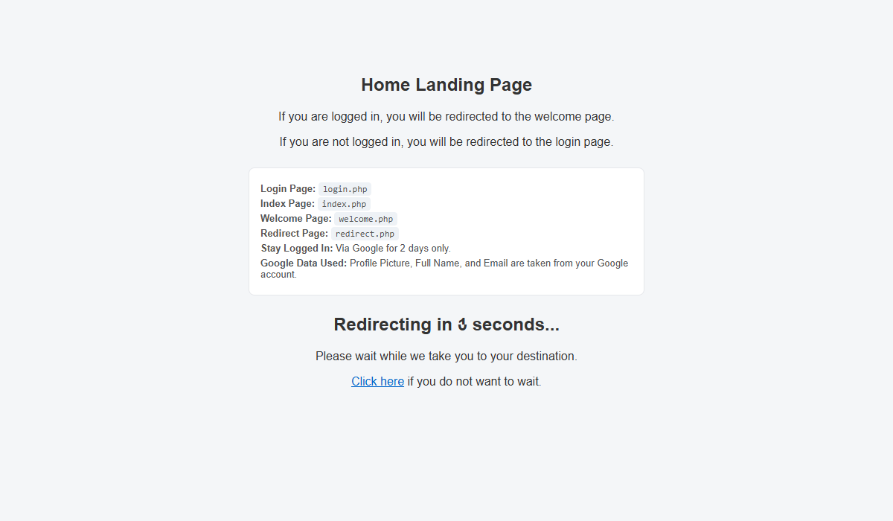
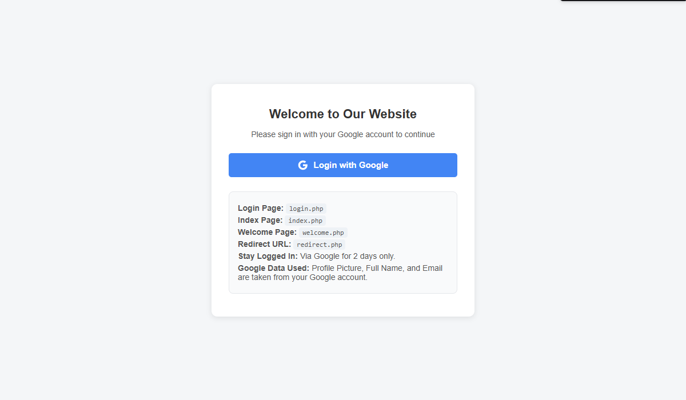
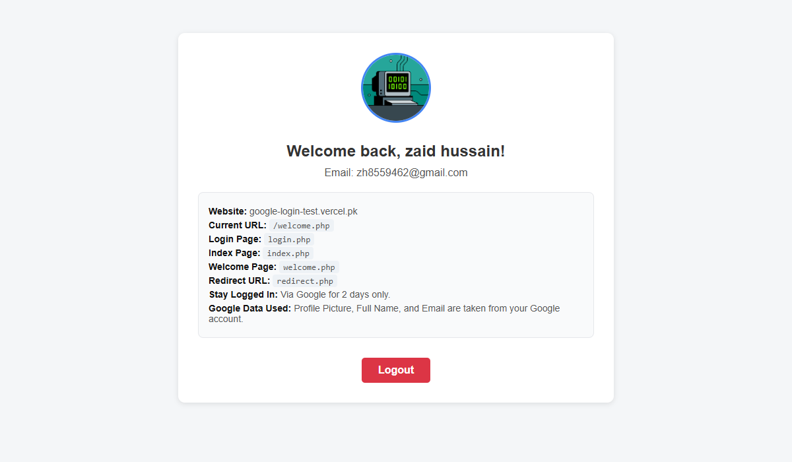

## 📸 Screenshots

| Homepage | Login Page | Dashboard |
| :---: | :---: | :---: |
|  |  |  |

```markdown
# PHP Google OAuth Login System

A lightweight, dependency-free Google OAuth 2.0 authentication and multi-device session management system built with **Pure PHP**, **MySQLi**, and **cURL**. Designed specifically for shared hosting (cPanel) environments without requiring Composer or bulky SDKs.

## 🚀 Features

* **Zero Dependencies:** Pure PHP implementation using cURL for lightweight performance.
* **Secure Architecture:** Uses a unique, unguessable `public_id` string as the primary key and foreign key reference.
* **Multi-Device Persistent Sessions:** Device-specific "Remember Me" tokens saved in the database with secure, HttpOnly cookies.
* **Smart Entry Routing:** Automatically detects existing sessions/cookies on the homepage (`index.php`) and login page (`login.php`), redirecting authenticated users straight to the dashboard.
* **Cascade Deletions:** Deleting a user automatically cleans up all associated device tokens via foreign key constraints.

---

## 📁 File Structure

```text
your-website-folder/
├── config.php            # Database connection & reusable auth verification function
├── index.php             # Public landing page with smart auth check
├── login.php             # Dedicated login portal with Google OAuth button
├── redirect.php          # cURL OAuth callback handler & user registration
├── welcome.php           # Protected dashboard page
└── logout.php            # Device-specific session & cookie destroyer

```

---

## 🛠️ Database Setup

Run the following SQL script in your MySQL database (via phpMyAdmin):

```sql
CREATE TABLE IF NOT EXISTS `users` (
  `public_id` VARCHAR(64) PRIMARY KEY,
  `google_id` VARCHAR(255) NOT NULL UNIQUE,
  `name` VARCHAR(255) NOT NULL,
  `email` VARCHAR(255) NOT NULL,
  `picture` VARCHAR(500) DEFAULT NULL,
  `created_at` TIMESTAMP DEFAULT CURRENT_TIMESTAMP
);

CREATE TABLE IF NOT EXISTS `user_tokens` (
  `id` INT AUTO_INCREMENT PRIMARY KEY,
  `user_id` VARCHAR(64) NOT NULL,
  `token` VARCHAR(255) NOT NULL,
  `token_expiry` DATETIME NOT NULL,
  FOREIGN KEY (`user_id`) REFERENCES `users`(`public_id`) ON DELETE CASCADE
);

```

---

## ⚙️ Configuration & Installation

1. Clone or download the repository into your local server or cPanel public directory.
2. Update your database credentials in **`config.php`**.
3. Head over to the [Google Cloud Console Credentials Page](https://console.cloud.google.com/auth/clients) to create your project credentials (Client ID and Client Secret).
4. Add your generated Google Client ID and Client Secret into **`login.php`** and **`redirect.php`**.
5. Configure your Google Cloud Console Authorized Redirect URI to point directly to your `redirect.php` file (e.g., `http://localhost/your-project/redirect.php` or `https://yoursite.com/redirect.php`).


